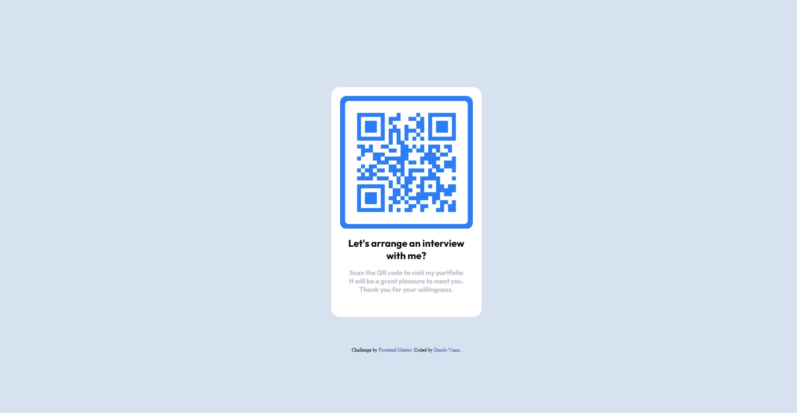

# Frontend Mentor - QR code component solution

This is a solution to the [QR code component challenge on Frontend Mentor](https://www.frontendmentor.io/challenges/qr-code-component-iux_sIO_H). Frontend Mentor challenges help you improve your coding skills by building realistic projects. 

## Table of contents

- [Overview](#overview)
  - [Screenshot](#screenshot)
- [My process](#my-process)
  - [Built with](#built-with)
  - [What I learned](#what-i-learned)
  - [Continued development](#continued-development)
  - [Useful resources](#useful-resources)
- [Author](#author)
- [Acknowledgments](#acknowledgments)

## Overview

### Screenshot

;


## My process
 
 I was challenged to make a Qrcode reader front with simple and punctual semantics. In the end, I really enjoyed exercising pure html and sass, as I had only been working with pure javascript for a few weeks.
 

### Built with

- Semantic HTML5 markup and basic structure;
- Custom CSS properties;
- Flexbox;
- CSS Grid;
- Mobile workflow;
-Improvement of css with Sass;

### What I learnedD

In fact, this exercise was to put into practice everything I learned from the Dev Fullstack course I finished. As I had been studying the Back-end language a lot for some time, I decided to go back a little and practice the front-end more.

It was important for me, because I reviewed it through HTML, CSS/SASS.

```scss

@import 'base';
@import 'footer';
@import url('https://fonts.googleapis.com/css2?family=Outfit:wght@100;400&display=swap');
@import url('https://fonts.googleapis.com/css2?family=Outfit:wght@100;700&display=swap');
@import url('https://fonts.googleapis.com/css2?family=Outfit:wght@100;400;700&display=swap');
.container {
    display: flexbox;
    .box {
        background-color: hsl(0, 0%, 100%);
        margin: self;
        width: 300px;
        height: 480px;
        padding: 20px;
        border-radius: 20px 20px 20px 20px;
        text-align: center;
    }
    img {
        width: 300px;
        height: 300px;
        border-radius: 10px 10px 10px 10px;
        transition: all;
        &:hover {
            width: 303px;
            height: 303px;
        }
    }
    h1 {
        fontsize: 22px;
        font-family: 'Outfit', sans-serif, bold;
        font-style: bold;
    }
    h3 {
        fontsize: 15px;
        font-family: 'Outfit', sans-serif, normal;
        color: hsl(212, 16%, 76%);
    }
}

```

### Continued development

Now, I will continue studying and reinforcing fluency in Javascript and developing more skills in nodeJS, React and React Native, to have greater security and thus start applying for new vacancies for my first job as Dev Jr.  

### Useful resources

- [Example resource 1](https://www.w3schools.com/css/) - This helped me a lot and I always recommend consulting for unlocking knowledge of CSS-SASS.

## Author

- My Linkedin: [linkedin](https://www.linkedin.com/in/danilovviana/)
- My Instagram: [instagram](https://www.instagram.com/danilovianadev/)


## Acknowledgments

Let's go! It was worth reading this far.


